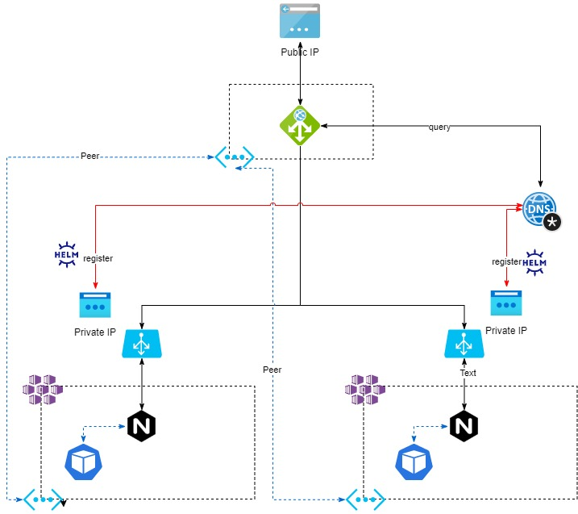

This template will create an app gateway in one region, two AKS cluster in 2 different regions (with peered vnets); deploy nginx ingress controller on each cluster with ILB service; map the ILB IP to a private DNS zone A record, add those records to the backend pool of the AppGw. This way, the Appgw will effectively loadbalance an app deployed on multiple clustes in multiple regions over a single frontend IP.



TODO:

- [] Zonal frontend IP
- [] SSL certificate termination at the AppGw
- [] Interpolate region in fqdn backend
- [] Add FrontDoor/Traffic Manager, add a second AppGw with the same backends, let TM deciced which AppGw is active and let the traffic be globally loadbalanced.

Test by applying in each cluster:

```bash
kubectl apply -f - <<EOF
apiVersion: v1
kind: Pod
metadata:
  labels:
    run: nginx
  name: nginx
  namespace: default
spec:
  containers:
  - image: nginx
    imagePullPolicy: Always
    name: nginx
    ports:
    - containerPort: 80
      protocol: TCP
---
apiVersion: v1
kind: Service
metadata:
  name: nginx
  namespace: default
spec:
  ports:
  - port: 80
    protocol: TCP
    targetPort: 80
  selector:
    run: nginx
---
apiVersion: networking.k8s.io/v1beta1
kind: Ingress
metadata:
  name: test-ingress
  annotations:
    nginx.ingress.kubernetes.io/rewrite-target: /
spec:
  rules:
  - http:
      paths:
      - backend:
          serviceName: nginx
          servicePort: 80
EOF
```

Test that the ingress and name resolution works:

```bash
az network vnet subnet create -n vm --vnet-name appgw_vnet -g appgwmultiaks --address-prefixes 10.10.1.0/24
az vm create --image UbuntuLTS -g appgwmultiaks -n vm2 --vnet-name appgw_vnet --subnet vm

nslookup ingress.c2.uksouth.aks.cluster
nslookup ingress.c1.northeurope.aks.cluster

curl ingress.c2.uksouth.aks.cluster
curl ingress.c1.northeurope.aks.cluster
```
